# Rallyo

Rallyo turns online communities into ongoing competitive social experiences. Communities run seasons, games, and contribution campaigns; members compete through participation and knowledge, build a persistent Rallyo identity, climb community rankings, and use Nimiq-backed identity for reward claims.

Rallyo is prepared for the Nimiq Mini Apps Competition Cycle II.

## Live

- App: https://rallyo.vercel.app
- Telegram bot: https://t.me/Rallyo_gamebot
- Source: https://github.com/Web3Kyami/Rallyo

## What Rallyo is

Rallyo gives a community a shared competitive record across the places where its members already spend time.

- Communities run active seasons with one shared leaderboard.
- Games turn project knowledge and community vocabulary into live participation.
- Social tasks let members contribute through campaign or recurring work.
- Positive score events from games, approved tasks, and authorized awards feed the same community record.
- A player keeps one Rallyo identity across communities.
- A Player identity can begin through Telegram or Nimiq.
- A verified Nimiq wallet is required to claim any Rallyo or community reward. It provides wallet-backed identity, proof of wallet control, and the destination for a claim.
- Players can answer games and build community points before connecting a wallet. Connect Nimiq before claiming rewards.

The live interaction surface is Telegram. The Rallyo web app makes the record visible through player, community admin, and platform operator views.

## Product surfaces

| Surface              | Purpose                                                                                                |
| -------------------- | ------------------------------------------------------------------------------------------------------ |
| Telegram communities | Live games, seasons, tasks, proof submission, review, and quick admin controls                         |
| Rallyo app           | Player identity, communities, global XP league, rankings, tasks, wallet state, and reward entitlements |
| Community admin      | Enable games, manage task campaigns, review submissions, and approve project questions or words        |
| Operator console     | Platform-level community, player, identity, reward, and audit operations behind a separate access key  |

## How it works

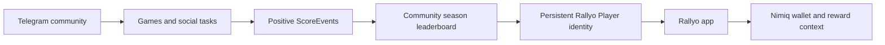

Players can start through Telegram or Nimiq. Telegram remains sufficient for answering games and accumulating community points, while a verified Nimiq wallet is required for every reward claim.

## Community competition model

Each community has its own active season and leaderboard. Multiple score sources contribute to that same season record:

- Project Quiz / Race rounds
- Word Seek wins
- Scramble wins
- Approved social task submissions
- Authorized positive manual awards

The implementation keeps the player, community, season, and score event relationships explicit. Game-specific records remain available for their own behavior and recovery, while the leaderboard aggregates through the shared score ledger.

## Games

The current Telegram runtime includes three game families:

| Game                | What players do                        | Current capabilities                                                                                                                |
| ------------------- | -------------------------------------- | ----------------------------------------------------------------------------------------------------------------------------------- |
| Project Quiz / Race | Answer a project or community question | Typed answers, multiple choice, first-correct scoring, timed rounds, progressive clues, difficulty, and prepared media presentation |
| Word Seek           | Solve the hidden word                  | Duplicate-safe feedback, guesses, clues, curated or approved project vocabulary, difficulty, timeout, and first-solver scoring      |
| Scramble            | Reconstruct a mixed-up term            | Curated or approved project vocabulary, difficulty, progressive hints, timeout, and first-correct scoring                           |

Approved community content is selected before a live round starts. A live target remains stable while the round is in progress. Live scoring does not call an LLM.

## Telegram commands

The public menu is intentionally compact. Players use `/help`, `/me`, `/leaderboard`, `/stats`, `/tasks`, `/submit`, and `/pair`. Community admins also get `/game`, `/stop`, `/settings`, and `/award`.

`/game` opens a short in-group controller for Quiz / Race, Word Seek, or Scramble. `/stop` closes the active Rallyo game in that community. `/award @username 10`, `/award @username -5 reason`, or a reply with `/award 10` records an auditable signed adjustment. The old low-level game and task commands remain hidden compatibility aliases where needed.

## Social contribution tasks

Social tasks are a first-class part of Rallyo. An admin can publish a recurring task or a campaign task with instructions, points, an optional target, a proof type, and submission limits.

Supported proof types are:

- URL
- Telegram screenshot or document
- URL plus screenshot

Players submit proof through the Telegram flow. A community admin reviews each submission manually. Approval creates exactly one positive `SOCIAL_TASK` score event. Rejection creates no points. Campaign limits, recurring daily limits, and cooldowns are enforced transactionally. Player-facing task announcements use a reusable square Rallyo artwork, show the target link and human-readable deadline, and cache Telegram media file IDs to avoid unnecessary re-uploads.

## Nimiq integration

Rallyo uses the Nimiq Mini App SDK inside Nimiq Pay and the official Nimiq Hub API in normal browsers. Both flows request the same Rallyo server challenge, sign that exact challenge, verify ownership server-side, and create the same canonical wallet identity and Rallyo session. Rallyo never handles private keys.

The implemented wallet flow is:

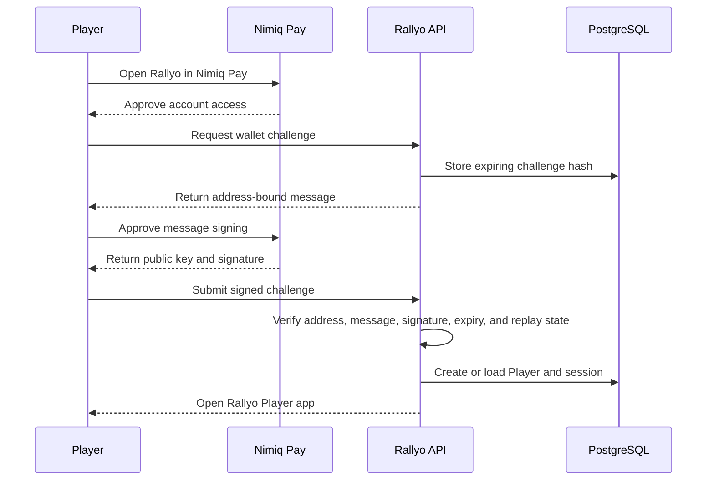

Telegram players can enter through a short-lived session or pairing code and keep playing before wallet connection. Connect Nimiq before claiming rewards. Pairing codes are one-time and expire after ten minutes; issuing a replacement code invalidates the previous active code for that Telegram identity. In a normal browser, Hub `chooseAddress()` selects an account and Hub `signMessage()` signs the server challenge. Rallyo verifies the Hub signed-message prefix and hash, public key, derived address, challenge expiry, and one-time consumption. Choosing an address alone is never treated as authentication.

The repository also contains a reward state machine for season entitlements. It covers eligibility, wallet requirements, per-claim and daily caps, idempotent entitlement creation, claim-in-progress state, failures, sent state, and confirmation. The current app API exposes reward entitlements and status, while reward sending is intentionally not exposed through the player app API. Treat live payout wiring and sender configuration as deployment work that must be verified separately.

## Player flows

### Player competition flow

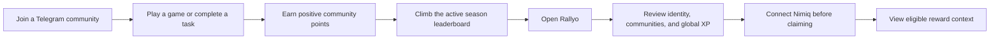

### Social task flow

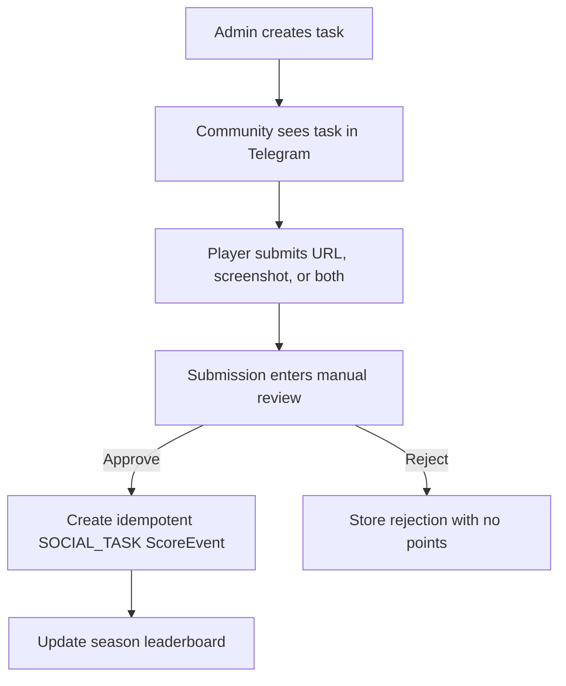

## Architecture

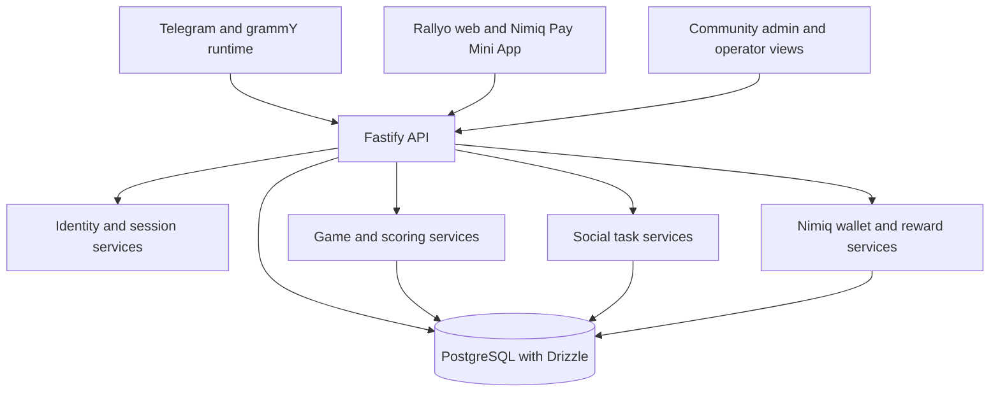

## Reliability and engineering

The current implementation includes several safeguards around live community state:

- A positive, source-aware `ScoreEvent` ledger with idempotency keys.
- Transactional first-winner arbitration for live game rounds.
- Persistent quiz, Word Seek, and Scramble sessions with replay guards.
- Scheduler recovery for persisted rounds, timeouts, clue reveals, and recurring schedules.
- Transactional social task caps and manual approval.
- Reward entitlement idempotency and explicit claim state transitions.
- Server-side community and admin authorization for app and Telegram actions.
- One-time Telegram pairing codes with expiry, replay protection, and replacement-code invalidation.
- LLM use kept outside the live scoring path.

## Technology

| Layer    | Technology                                          |
| -------- | --------------------------------------------------- |
| Runtime  | Node.js 22 or newer, TypeScript 5.9                 |
| Monorepo | npm workspaces                                      |
| Telegram | grammY                                              |
| API      | Fastify 5                                           |
| Database | PostgreSQL with Drizzle ORM                         |
| Web      | React 19 and Vite 8                                 |
| Wallet   | `@nimiq/mini-app-sdk`, `@nimiq/hub-api`, Nimiq Core |
| Tests    | Vitest 5                                            |

## Repository layout

```text
apps/
  server/          Fastify API, Telegram runtime, scoring, tasks, rewards, migrations
  web/             React/Vite player, admin, operator, and public surfaces
packages/
  core/            Shared scoring, season, normalization, and environment contracts
  nimiq/           Nimiq integration boundary
  telegram/        Telegram bot package boundary
drizzle/           PostgreSQL migrations and schema snapshots
docs/screenshots/  Safe product screenshots used in this README
```

## Screenshots

These captures show the current public web surfaces and the app entry flow. The Telegram GUI is not available in this repository environment, so no Telegram screenshot is presented as if it were captured here.

| Public entry                                                                        | Player entry                                                                      |
| ----------------------------------------------------------------------------------- | --------------------------------------------------------------------------------- |
| 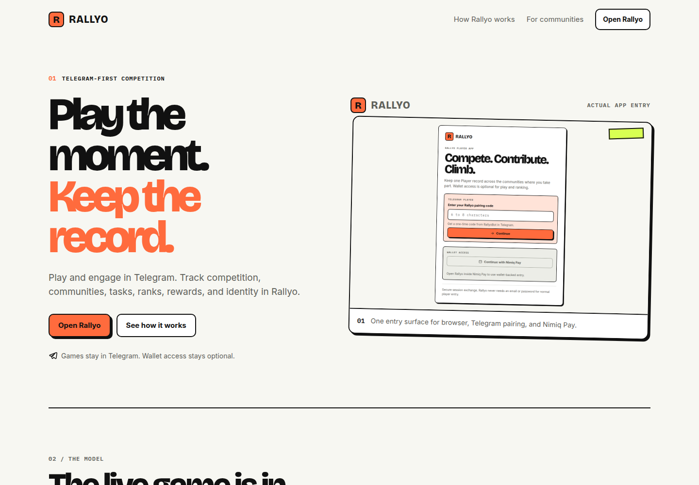 | 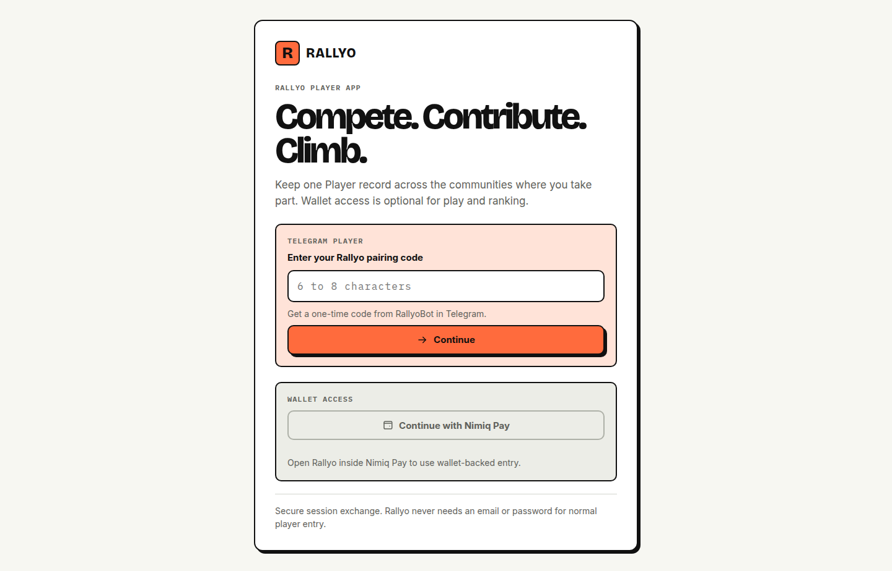 |
| 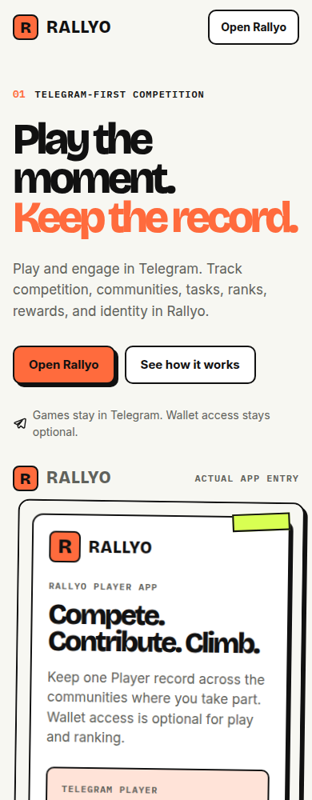   | 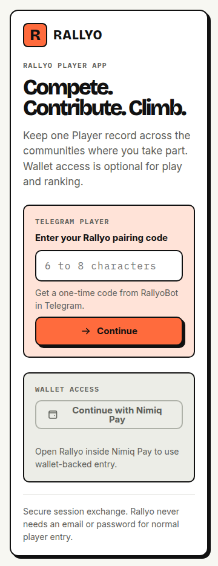   |

| Nimiq Pay player surface                                                | Community admin                                                                                     |
| ----------------------------------------------------------------------- | --------------------------------------------------------------------------------------------------- |
| 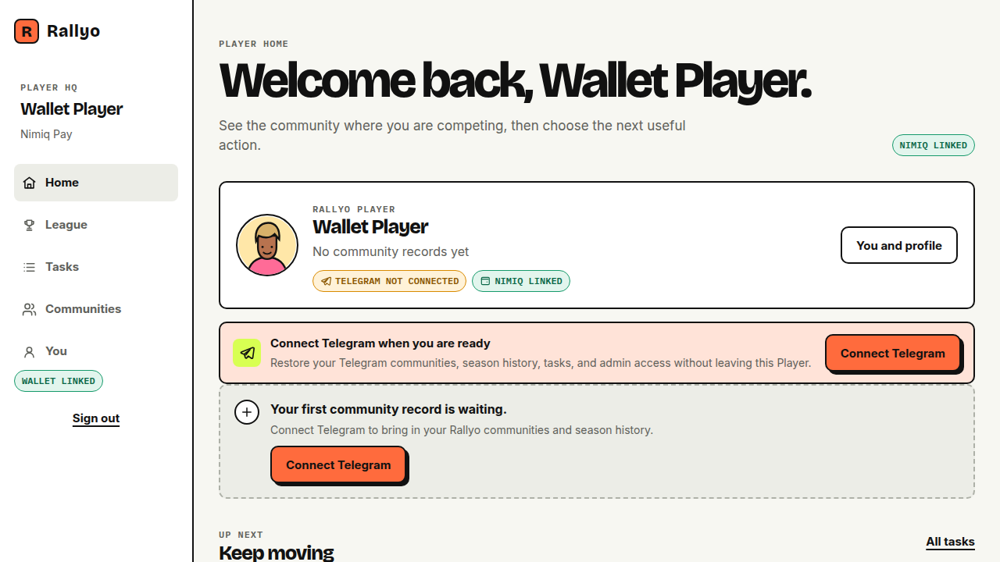 | 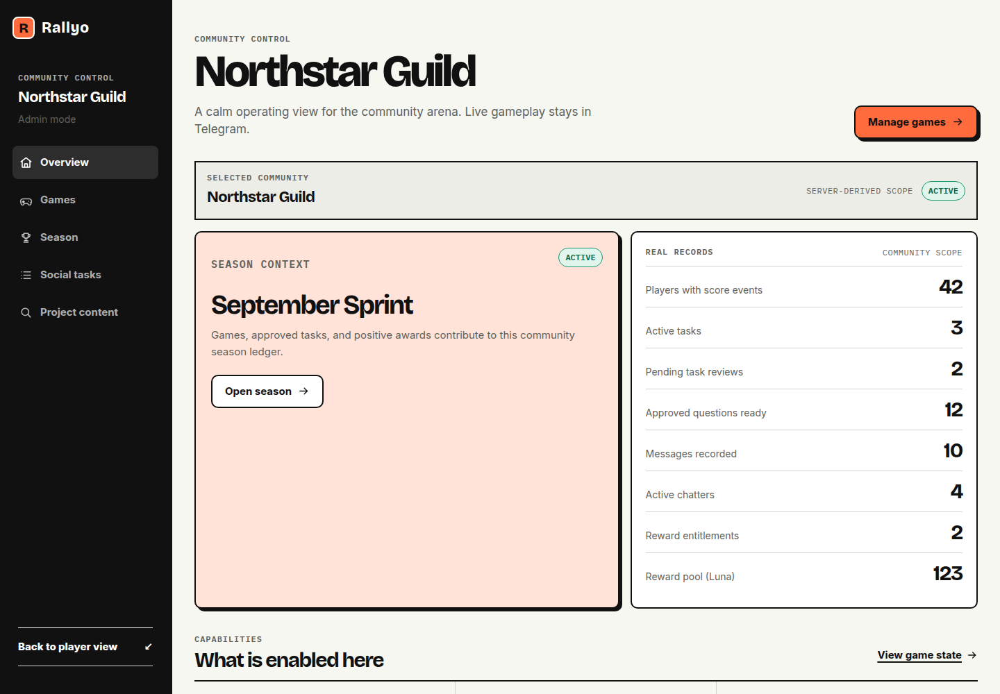                    |
|                                                                         | 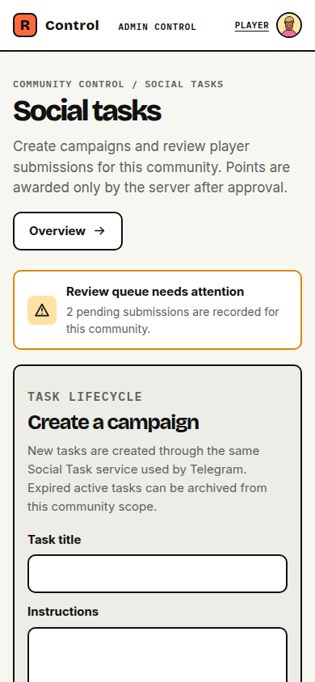 |

## Local development

Rallyo is an npm workspaces project. Use Node.js 22 or newer and npm 10 or newer.

```bash
npm install
cp .env.example .env
```

Set local values in `.env`. At minimum, a server connected to PostgreSQL needs `DATABASE_URL`; Telegram testing needs `TELEGRAM_BOT_TOKEN`; and the web session flow needs `SESSION_SECRET`. `OPERATOR_ACCESS_KEY` is optional and protects the operator console. Keep all real tokens, database URLs, signing keys, and wallet credentials out of Git.

For a split web and API deployment, set `VITE_API_BASE_URL` in the web build environment to the public API origin. The repository intentionally does not commit an infrastructure-specific API hostname.

Run the schema and checks against a disposable or test database:

```bash
npm run db:migrate
npm run typecheck
npm run lint
npm run format:check
npm test -- --no-file-parallelism --maxWorkers=1
npm run build
```

Start the server and web app separately during local development:

```bash
npm run dev:server
npm run dev:web
```

For local Telegram polling, set `TELEGRAM_TRANSPORT=polling`. Webhook mode requires a public HTTPS endpoint and `TELEGRAM_WEBHOOK_SECRET`. Typed Quiz/Race answers depend on Telegram delivering ordinary group messages, so BotFather privacy mode must allow those messages or Rallyo must have sufficient group access.

The current `main` is verified against a disposable PostgreSQL database with migrations `0000` through `0017` applied. The complete verification run passed 28 test files and 158 tests. A test run without `DATABASE_URL` skips database integration files, so it is not equivalent to the complete verification command above.

## Open-source attribution

Rallyo adapts selected MIT-licensed behavior from upstream Telegram game implementations. See [THIRD_PARTY_NOTICES.md](THIRD_PARTY_NOTICES.md) for the exact projects, commits, adapted areas, and preserved license text.

## License

[MIT](LICENSE)
